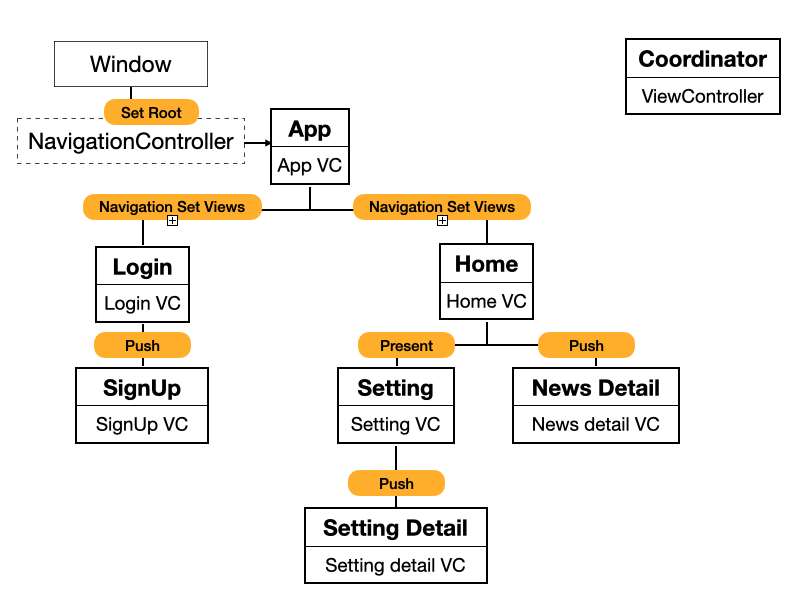

## Coordinator 패턴 - Task 1 Coordinator를 구현해보자.


### 목표




**세상 보기 깔끔한 enum으로 정리해보면?**

```objectivec
enum App {
    case login
    case home
}

enum Login {
    case signUp
}

enum Home {
    case setting
    case newsDetail
}

enum Setting {
    case settingDetail
}
```

**Coordinator는 다음과 같은 모양일 것 같습니다.**

```objectivec

class Coordinator {

	var children: [Coordinator] = []
	
	func start() {
		// viewController를 보여준다.
	}
}

```

**AppDelegate에서 구동을 시작한다면 아마도 다음과 같은 모양?**

```
let coordinator = Coordinator() 
coordinator.start()

```


**기본 모양은 대충 봤으니, Coordinator를 추상화해봅니다.**

```objectivec

protocol Coordinator {
    
    var children: [Coordinator] { get }
    
    func start()
}

```